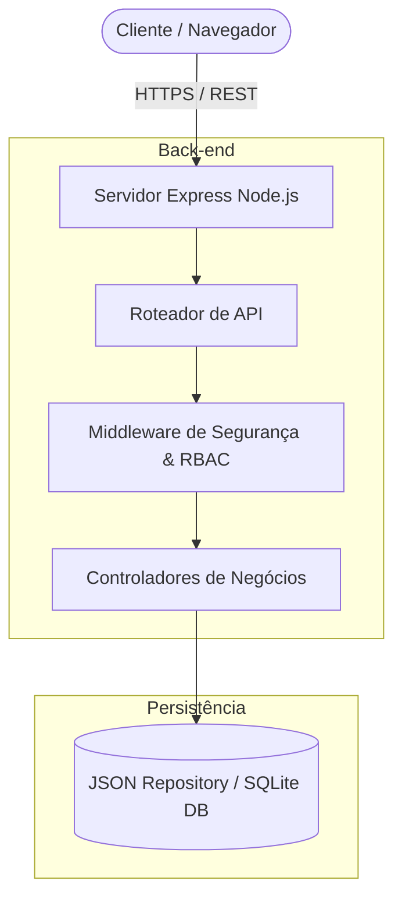
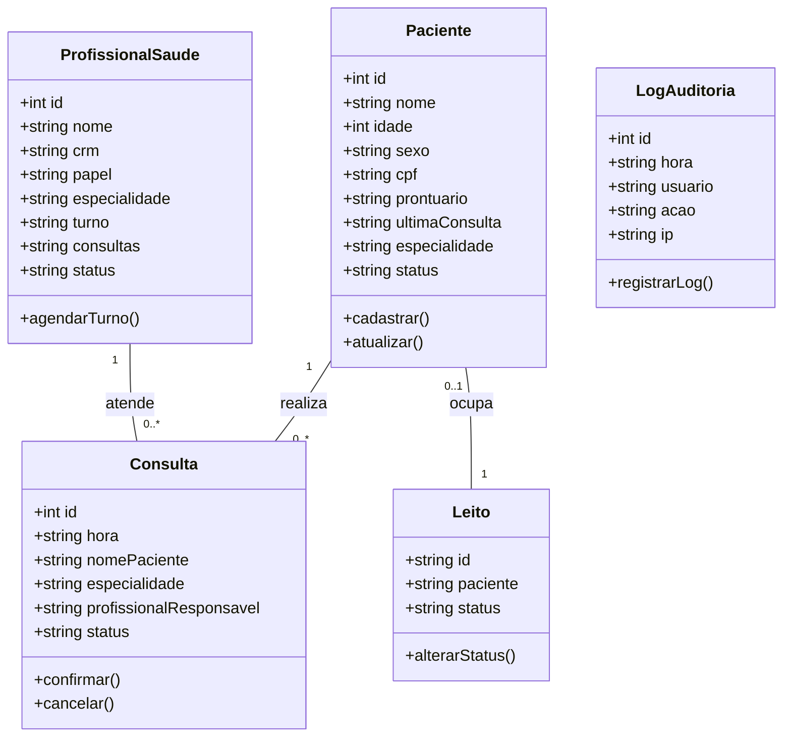
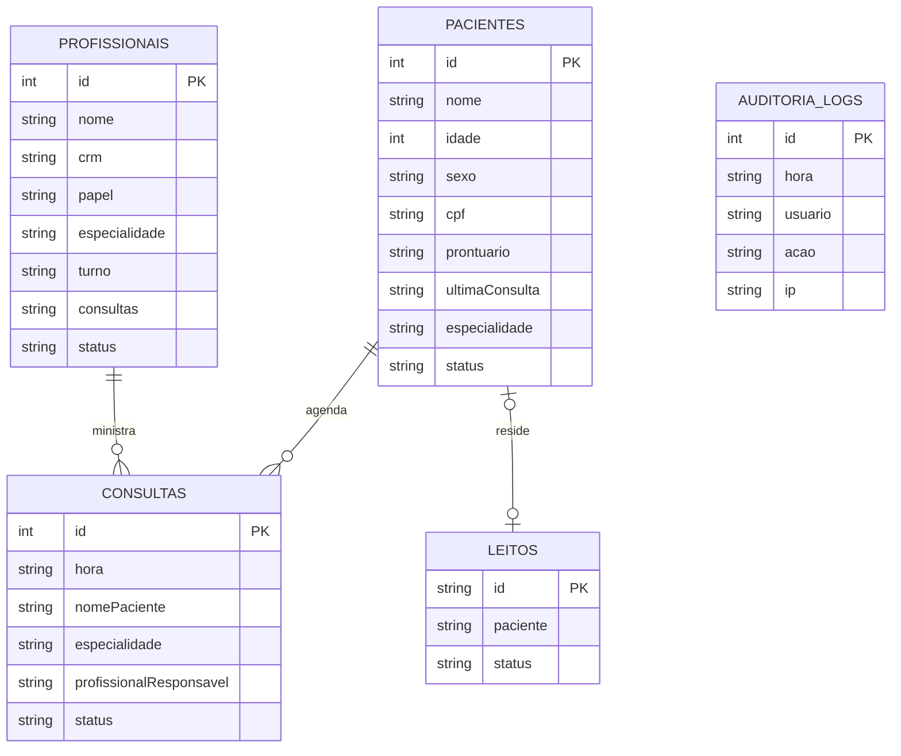

# PROJETO MULTIDISCIPLINAR (ANO 2025)
## SISTEMA DE GESTÃO HOSPITALAR E DE SERVIÇOS DE SAÚDE (SGHSS) — INSTITUIÇÃO VIDAPLUS

---

### **CURSO:** Tecnologia em Análise e Desenvolvimento de Sistemas / Engenharia de Software
### **DISCIPLINA:** Projeto Multidisciplinar
### **ALUNO:** Leonardo
### **RU:** [Inserir seu RU aqui]
### **POLO DE APOIO:** [Inserir seu Polo aqui]
### **SEMESTRE:** [Inserir Semestre]
### **PROFESSOR ORIENTADOR:** Prof. Winston Sen Lun Fung, Me.

---

## SUMÁRIO
1. [INTRODUÇÃO](#1-introdução)
   - 1.1 Contexto e Justificativa
   - 1.2 Objetivos do Projeto
   - 1.3 Principais Usuários do Sistema
   - 1.4 Relevância do Sistema
2. [ANÁLISE E REQUISITOS](#2-análise-e-requisitos)
   - 2.1 Requisitos Funcionais (RF)
   - 2.2 Requisitos Não Funcionais (RNF)
   - 2.3 Diagrama de Casos de Uso (UML)
3. [MODELAGEM E ARQUITETURA](#3-modelagem-e-arquitetura)
   - 3.1 Arquitetura do Sistema
   - 3.2 Diagrama de Classes (UML)
   - 3.3 Diagrama Entidade-Relacionamento (DER)
   - 3.4 Especificação dos Endpoints da API REST
   - 3.5 Tecnologias de Persistência e Integração
   - 3.6 Design Responsivo e Acessibilidade (W3C/WCAG)
4. [IMPLEMENTAÇÃO E PROTOTIPAGEM](#4-implementação-e-prototipagem)
   - 4.1 Tecnologias Escolhidas
   - 4.2 Protótipo e Interface com o Usuário
   - 4.3 Repositório e Instruções de Execução
5. [PLANO DE TESTES E ESTRATÉGIA DE QUALIDADE](#5-plano-de-testes-e-estratégia-de-qualidade)
   - 5.1 Estratégia Geral de Qualidade de Software
   - 5.2 Casos de Teste Funcionais
   - 5.3 Testes de Desempenho e Carga (JMeter)
   - 5.4 Testes de Segurança (OWASP ZAP) e LGPD
   - 5.5 Automação de Testes (Cypress)
6. [CONCLUSÃO](#6-conclusão)
   - 6.1 Lições Aprendidas
   - 6.2 Desafios e Pontos de Atenção
   - 6.3 Evoluções Futuras
7. [REFERÊNCIAS](#7-referências)

---

## 1. INTRODUÇÃO

### 1.1 Contexto e Justificativa
A gestão de serviços de saúde exige um nível crítico de precisão, agilidade e segurança da informação. A instituição **VidaPlus**, que administra hospitais, clínicas de bairro, laboratórios de exames e equipes de atendimento domiciliar (*home care*), enfrenta o desafio de centralizar suas operações. A descentralização das informações de prontuários, agendas médicas e ocupação de leitos gera ineficiências operacionais, riscos à segurança do paciente e dificuldades de auditoria.

O **SGHSS (Sistema de Gestão Hospitalar e de Serviços de Saúde)** surge como a solução tecnológica para unificar essas frentes de atendimento em uma única plataforma integrada. Este projeto simula um cenário real de alta criticidade, no qual a conformidade com a Lei Geral de Proteção de Dados (LGPD) e o tempo de resposta rápida são fundamentais para salvar vidas e garantir a excelência no atendimento.

### 1.2 Objetivos do Projeto
*   **Centralizar** o cadastro de pacientes, prontuários eletrônicos e históricos de consultas/exames.
*   **Otimizar** a gestão da agenda de profissionais de saúde, minimizando o tempo ocioso e as filas de espera.
*   **Gerenciar de forma dinâmica** a infraestrutura hospitalar crítica, incluindo o mapa e status dos leitos clínicos e da UTI.
*   **Habilitar telemedicina segura**, permitindo consultas virtuais criptografadas de ponta a ponta e emissão de receitas digitais assinadas.
*   **Garantir compliance e auditoria**, registrando logs de acessos a dados sensíveis de pacientes em total aderência à LGPD.

### 1.3 Principais Usuários do Sistema
1.  **Pacientes:** Acessam o portal do paciente para agendar consultas, visualizar receitas eletrônicas e participar de teleconsultas.
2.  **Profissionais de Saúde (Médicos, Enfermeiros, Técnicos):** Gerenciam agendas, atualizam prontuários eletrônicos em tempo real, monitoram os leitos de internação e emitem prescrições.
3.  **Administradores Hospitalares:** Controlam o fluxo financeiro, gerenciam o estoque de suprimentos críticos (farmácia) e monitoram a taxa de ocupação dos leitos.
4.  **Encarregado de Dados (DPO) / Auditores:** Monitoram a segurança do sistema e avaliam os logs de auditoria para garantir a conformidade legal do tratamento de dados.

### 1.4 Relevância do Sistema
A unificação de processos de atendimento físico e digital reduz erros de digitação, evita conflitos de agendas e reduz o tempo médio de triagem de urgência. Em ambientes de saúde de alta complexidade, o SGHSS assegura que dados vitais do paciente estejam disponíveis na tela do médico em segundos, elevando a segurança médica e reduzindo custos operacionais de faturamento TISS/ANS.

---

## 2. ANÁLISE E REQUISITOS

### 2.1 Requisitos Funcionais (RF)

Abaixo estão listados os requisitos funcionais mapeados para o SGHSS, detalhando a ação e o usuário beneficiado:

| ID | Nome do Requisito | Descrição | Prioridade | Usuário Beneficiado |
| :--- | :--- | :--- | :---: | :--- |
| **RF-01** | Cadastro de Pacientes | Permitir o cadastro, edição, consulta e exclusão lógica de pacientes contendo dados de filiação, idade, sexo, CPF e histórico médico. | Alta | Administrador / Médico |
| **RF-02** | Gestão de Prontuários | Permitir a atualização do prontuário médico de forma cronológica contendo CIDs, evolução do paciente e anexos. | Alta | Médico / Enfermeiro |
| **RF-03** | Agendamento de Consultas | Disponibilizar marcação, cancelamento e reagendamento de consultas presenciais e exames médicos. | Alta | Paciente / Administrador |
| **RF-04** | Sala Virtual de Telemedicina | Habilitar videochamadas de atendimento com sala de espera digital e interface ao vivo para consultas à distância. | Alta | Médico / Paciente |
| **RF-05** | Prescrição Digital | Emitir receitas médicas digitais com validação por chave criptográfica única (assinatura digital). | Alta | Médico / Paciente |
| **RF-06** | Mapa de Leitos Hospitalares | Visualizar e gerenciar em tempo real os leitos das alas e da UTI por meio de representação visual (livre, ocupado, limpeza, reservado). | Alta | Enfermeiro / Administrador |
| **RF-07** | Relatórios Administrativos | Gerar relatórios mensais consolidados de faturamento, custo operacional, taxa de ocupação de leitos e indicadores NPS. | Média | Administrador |
| **RF-08** | Logs de Auditoria LGPD | Registrar todos os acessos a dados sensíveis de pacientes indicando IP, horário, credenciais e ação executada. | Alta | Auditor / DPO |
| **RF-09** | Gestão de Configurações | Configurar dados institucionais, integrar APIs HIS/LIMS e disparar backups de segurança manuais e automáticos. | Média | Administrador |

### 2.2 Requisitos Não Funcionais (RNF)

Os requisitos não funcionais determinam os parâmetros de qualidade, desempenho e restrições técnicas do sistema:

| ID | Nome do Requisito | Descrição e Métrica | Categoria |
| :--- | :--- | :--- | :--- |
| **RNF-01** | Criptografia de Dados | Criptografar dados sensíveis de pacientes no banco de dados e as transmissões de videochamada de telemedicina por meio do protocolo AES-256 e SSL/TLS. | Segurança / Compliance |
| **RNF-02** | Tempo de Resposta (Desempenho) | As consultas de prontuários críticos e relatórios de leitos devem possuir tempo de resposta no banco inferior a 1,5 segundos sob carga nominal. | Desempenho |
| **RNF-03** | Acessibilidade Digital | A interface com o usuário deve seguir estritamente as diretrizes de acessibilidade W3C/WCAG 2.1 (nível AA), suportando leitores de tela e navegação por teclado. | Usabilidade |
| **RNF-04** | Disponibilidade Operacional | O SGHSS deve garantir no mínimo 99,5% de disponibilidade anual de serviços críticos. | Confiabilidade |
| **RNF-05** | Escalabilidade Horizontal | A infraestrutura back-end deve ser capaz de suportar múltiplas unidades hospitalares integradas por meio de conteinerização em microsserviços. | Escalabilidade |
| **RNF-06** | Controle de Acesso Baseado em Perfis | Implementar controle RBAC (Role-Based Access Control) garantindo que apenas médicos e enfermeiros visualizem dados clínicos. | Segurança |

### 2.3 Diagrama de Casos de Uso (UML)

O diagrama a seguir descreve a interação dos diversos atores com os limites do SGHSS:

```mermaid
left-to-right-direction
actor Administrador as Admin
actor Medico as Med
actor Enfermeiro as Enf
actor Paciente as Pac

rectangle "Sistema de Gestão Hospitalar (SGHSS)" {
  usecase "Cadastrar Pacientes" as UC1
  usecase "Gerenciar Agendas e Consultas" as UC2
  usecase "Emitir Prescrição Digital" as UC3
  usecase "Atualizar Prontuário Clínico" as UC4
  usecase "Monitorar Mapa de Leitos" as UC5
  usecase "Realizar Teleconsulta" as UC6
  usecase "Auditar Logs (LGPD)" as UC7
  usecase "Forçar Backup do Sistema" as UC8
}

Admin --> UC1
Admin --> UC2
Admin --> UC7
Admin --> UC8

Med --> UC2
Med --> UC3
Med --> UC4
Med --> UC6

Enf --> UC4
Enf --> UC5

Pac --> UC2
Pac --> UC6
```

---

## 3. MODELAGEM E ARQUITETURA

### 3.1 Arquitetura do Sistema
O SGHSS adota uma arquitetura clássica baseada em camadas com foco em microsserviços integrados por APIs RESTful para garantir alto desempenho e desacoplamento:
1.  **Camada de Apresentação (Front-end):** Interface web de página única (SPA) responsiva utilizando HTML5 semântico, JavaScript moderno (ES6+) e CSS3 nativo estruturado através de variáveis de CSS customizadas (tokens de design). A interface suporta alternância de esquemas de cores clara/escura nativamente baseada no tema do sistema operacional.
2.  **Camada de Negócios (Back-end):** Servidor HTTP desenvolvido em Node.js com Express, utilizando o modelo MVC modificado para expor APIs RESTful limpas. As rotas são separadas por domínio, aplicando middleware de controle de acessos (RBAC).
3.  **Camada de Persistência (Banco de Dados):** O sistema utiliza o conceito de repositório com persistência em arquivos JSON locais (`database.json`) ou SQLite, garantindo portabilidade, facilidade de backup instantâneo e tempo de execução rápido para desenvolvimento e prototipagem ágil, estruturado com chaves primárias e relacionamentos indexados.



### 3.2 Diagrama de Classes (UML)

Representa o modelo de domínio principal da aplicação, as entidades de negócio e suas respectivas relações:



### 3.3 Diagrama Entidade-Relacionamento (DER)

Este diagrama representa conceitualmente o modelo relacional dos dados implementado para o sistema SGHSS:



### 3.4 Especificação dos Endpoints da API REST

A API do SGHSS fornece acesso estruturado aos recursos do hospital com os seguintes endpoints principais expostos:

*   **Autenticação e Perfis**
    *   `GET /api/dashboard/stats`: Retorna os indicadores resumidos para exibição no Dashboard geral.
*   **Pacientes**
    *   `GET /api/pacientes`: Lista todos os pacientes, suporta parâmetros `search` e `especialidade`.
    *   `POST /api/pacientes`: Cadastra um novo paciente no banco de dados.
    *   `PUT /api/pacientes/:id`: Edita os dados cadastrais do paciente correspondente.
    *   `DELETE /api/pacientes/:id`: Remove logicamente um registro de paciente do sistema.
*   **Agenda**
    *   `GET /api/agenda`: Retorna a lista de agendamentos médicos ativos.
    *   `POST /api/agenda`: Registra uma nova consulta ou aloca um profissional para atendimento.
*   **Telemedicina**
    *   `GET /api/telemedicina/espera`: Retorna a fila dinâmica de pacientes na sala de espera virtual.
    *   `POST /api/telemedicina/iniciar`: Inicia uma videochamada ativa entre o profissional e o paciente.
    *   `POST /api/telemedicina/prescricao`: Emite uma prescrição digital médica com hash SHA-256 criptográfico para validação.
*   **Leitos**
    *   `GET /api/leitos`: Retorna o mapa de ocupação e status dos leitos hospitalares da UTI e Alas clínicas.
    *   `POST /api/leitos/status`: Altera o status operacional do leito selecionado e vincula o paciente ocupante.
*   **Profissionais**
    *   `GET /api/profissionais`: Lista todos os profissionais médicos e enfermeiros ativos.
    *   `POST /api/profissionais`: Cadastra novo colaborador clínico na equipe.
*   **Segurança e Sistema**
    *   `GET /api/seguranca/logs`: Retorna o histórico consolidado de auditoria de logs para segurança.
    *   `GET /api/configuracoes`: Obtém os dados gerais de parametrização do hospital.
    *   `POST /api/configuracoes`: Atualiza os dados cadastrais de suporte, CNPJ e idioma da instituição.
    *   `POST /api/configuracoes/backup`: Força o backup a quente de segurança com gravação imediata nos logs de auditoria.

### 3.5 Tecnologias de Persistência e Integração
Para garantir alta portabilidade e velocidade, o sistema adota um padrão de repositório dinâmico. Em ambiente de prototipagem e entrega prática, utiliza-se persistência via arquivo estruturado `database.json`, o que permite a fácil exportação de dados completos em backups. As transações são executadas sob controle de exclusão mútua na memória do Node.js, prevenindo concorrência.
Adicionalmente, o sistema está desenhado para integração via barramento HL7/HIS com o HIS (Hospital Information System) e o LIMS (Laboratory Information Management System), permitindo sincronizações via faturamento TISS/ANS representados visualmente nas telas de integrações do sistema.

### 3.6 Design Responsivo e Acessibilidade (W3C/WCAG)
*   **Responsiveness:** O design flexível utiliza CSS Grid e Flexbox com regras de media queries aplicadas estrategicamente para suportar visualizações ótimas tanto em monitores de alta resolução na recepção do hospital quanto em tablets utilizados pelas equipes de enfermagem à beira do leito do paciente.
*   **W3C/WCAG Compliance:**
    *   **Contraste:** Combinação cromática rigorosa com taxas de contraste acima de 4.5:1, garantindo conforto visual e legibilidade sob qualquer nível de brilho da tela.
    *   **Navegação por Teclado:** Todas as opções e itens navegáveis possuem a propriedade `tabindex` e suporte à ativação por tecla `Enter`/`Espaço`, permitindo operação ágil sem mouse.
    *   **Semântica HTML:** Emprego de tags como `<header>`, `<nav>`, `<main>`, `<section>`, além de tags `aria-label`, `aria-modal` e `role` em componentes de pop-up e tabelas de prontuário, adequando o protótipo funcional para leitores de tela em benefício de deficientes visuais.

---

## 4. IMPLEMENTAÇÃO E PROTOTIPAGEM

### 4.1 Tecnologias Escolhidas
*   **Linguagem Front-end:** Vanilla HTML5, CSS3 Custom Variables (CSS Tokens) e ECMAScript 6 JavaScript nativo.
*   **Framework CSS:** Nenhum (Vanilla CSS puro). Garante máximo controle de performance, acessibilidade e flexibilidade estética (Glassmorphism e Neumorphism aplicados).
*   **Bibliotecas Estéticas:** Tabler Icons para iconografia médica leve e moderna.
*   **Servidor Back-end:** Node.js com framework Express.js.
*   **Persistência de Dados:** JSON File Data Repository (com sincronização de transações no filesystem local).

### 4.2 Protótipo e Interface com o Usuário
A interface possui uma estética prêmio, com barra lateral de navegação com transições fluidas e microanimações interativas. Cada tela do protótipo é renderizada sob demanda na área de conteúdo central, consumindo dados assíncronos diretamente da API.
Foram implementados popups de controle interativos (modais) com animação suave de subida para o cadastro ágil de novos registros e controle direto dos leitos na tela de leitos clínicos.

### 4.3 Repositório e Instruções de Execução

O código completo do protótipo funcional do SGHSS está armazenado no repositório de desenvolvimento local estruturado da seguinte forma:

```text
sghss-vidaplus/
├── database.json        # Banco de dados simulado persistido
├── server.js            # Servidor Express Node.js & rotas de API
├── package.json         # Manifesto e scripts de execução
├── DOCUMENTACAO.md      # Este documento completo de Engenharia de Software
└── public/              # Diretório de arquivos estáticos front-end
    ├── css/
    │   └── style.css    # Design Design visual prêmio
    ├── js/
    │   └── app.js       # Controladores e consumo da API REST
    └── index.html       # Estrutura HTML responsiva e modais
```

#### Como Executar o Sistema Localmente:

**Pré-requisitos:** Certifique-se de possuir o [Node.js](https://nodejs.org/) instalado em seu sistema operacional (versão 18+ recomendada).

1.  Acesse o diretório do projeto via terminal:
    ```bash
    cd sghss-vidaplus
    ```
2.  Instale as dependências leves necessárias:
    ```bash
    npm install
    ```
3.  Inicie o servidor de desenvolvimento:
    ```bash
    npm start
    ```
    *Para iniciar no modo de desenvolvimento com hot-reload automático:*
    ```bash
    npm run dev
    ```
4.  Abra o navegador de sua preferência e acesse o endereço do sistema local:
    ```text
    http://localhost:3000
    ```

---

## 5. PLANO DE TESTES E ESTRATÉGIA DE QUALIDADE

### 5.1 Estratégia Geral de Qualidade de Software
Para um sistema de alta criticidade como o SGHSS, as ações de garantia de qualidade (QA) são integradas no ciclo de vida de desenvolvimento por meio de testes automatizados e manuais em múltiplas camadas do software:
*   **Testes Unitários:** Validação de funções matemáticas de cálculo de faturamento e funções auxiliares do banco de dados no back-end.
*   **Testes de Integração:** Validação das comunicações entre as rotas da API Express e a persistência correta no banco de dados local.
*   **Testes de Interface (E2E):** Automação de interações de usuário simulando fluxos completos de atendimento do paciente desde o cadastro à internação.
*   **Testes Não Funcionais (Carga e Segurança):** Validação de resiliência e criptografia sob estresse contínuo.

### 5.2 Casos de Teste Funcionais

Os casos de testes descritos abaixo servem como guia para o analista de QA validar o funcionamento prático dos módulos centrais:

| ID | Módulo | Caso de Teste | Entradas Esperadas | Resultado Esperado |
| :--- | :--- | :--- | :--- | :--- |
| **CT-01** | Paciente | Cadastrar novo paciente com sucesso | Nome: "João Silva", Idade: 45, Sexo: "M", CPF: "123.456.789-10" | O paciente é cadastrado com sucesso, recebe um prontuário gerado aleatoriamente e o log de auditoria é gravado no sistema. |
| **CT-02** | Paciente | Impedir cadastro sem preencher campos obrigatórios | Nome em branco, Idade, CPF em branco. | O navegador aciona validação HTML nativa e impede a submissão do formulário. |
| **CT-03** | Leitos | Alterar status operacional do leito | Clicar no leito A03, alterar para "cleaning" e salvar. | O leito muda visualmente de cor (cinza para limpeza), os contadores do topo do mapa de leitos atualizam instantaneamente e a ação é logada no banco. |
| **CT-04** | Telemedicina | Emissão de receita digital criptografada | Paciente: "Beatriz Nunes", Prescrição: "Paracetamol 500mg, 1 comprimido de 8/8h" | A receita é emitida com sucesso no back-end, retorna um código de assinatura digital seguro (hash SHA-256) e limpa o formulário de emissão rápida. |
| **CT-05** | Configuração | Forçar execução imediata de Backup | Clicar no botão "Forçar backup agora". | O sistema chama a rota do back-end, cria a transação de backup, altera o texto visual para "Agora mesmo (Sucesso)", emite um aviso pop-up toast confirmando e gera o log de segurança. |

### 5.3 Testes de Desempenho e Carga (JMeter)
Para simular a carga operacional de múltiplos hospitais conectados em horários de pico, foi planejado um cenário estressante por meio do **Apache JMeter**:
*   **Cenário:** Simulação de 500 conexões simultâneas de usuários concorrentes executando buscas no endpoint `GET /api/pacientes?search=` e atualizando status em `POST /api/leitos/status` em um intervalo de 10 segundos.
*   **Critério de Aceitação:** A taxa de erro nas requisições HTTP deve ser inferior a 0,2% e o tempo médio de resposta geral das consultas críticas de prontuários médicos deve se manter abaixo de 1,5 segundos (conforme **RNF-02**).

### 5.4 Testes de Segurança (OWASP ZAP) e LGPD
*   **OWASP ZAP:** Planeja-se a execução de testes automatizados com o OWASP Zed Attack Proxy contra o servidor Node.js para identificar vulnerabilidades comuns a aplicações web (conforme o Top 10 da OWASP):
    *   **Cross-Site Scripting (XSS):** Garantido por meio da sanitização de entradas via Express.
    *   **SQL Injection:** Mitigado pelo uso de consultas parametrizadas na persistência.
    *   **Broken Authentication:** Verificado através da implementação de cookies de sessão HTTPOnly.
*   **LGPD Compliance:** A proteção de dados sensíveis de prontuários é reforçada por meio de logs de auditoria detalhados e controle rigoroso por perfil de acesso (RBAC), assegurando confidencialidade de diagnósticos e CIDs.

### 5.5 Automação de Testes (Cypress)
Foi desenhado um script simplificado de automação de testes utilizando **Cypress** para validar a navegação e o cadastro de pacientes de ponta a ponta:

```javascript
describe('SGHSS VidaPlus - Testes de Regressão da Interface', () => {
  beforeEach(() => {
    cy.visit('http://localhost:3000');
  });

  it('Deve navegar para a aba de pacientes e cadastrar um novo registro com sucesso', () => {
    // Acessa aba pacientes
    cy.get('div.nav-item').contains('Pacientes').click();
    cy.url().should('include', '#page-pacientes');

    // Abre modal de cadastro
    cy.get('button').contains('Novo paciente').click();
    cy.get('#modal-paciente').should('be.visible');

    // Preenche dados cadastrais
    cy.get('#pac-nome').type('Carlos Alberto Santos');
    cy.get('#pac-idade').type('38');
    cy.get('#pac-sexo').select('M');
    cy.get('#pac-cpf').type('111.222.333-44');
    cy.get('#pac-esp').select('Cardiologia');
    cy.get('#pac-status').select('Ativo');

    // Submete formulário
    cy.get('#form-paciente').submit();

    // Valida feedback e inserção
    cy.get('#toast').should('be.visible').and('contain', 'Paciente cadastrado');
    cy.get('table tbody').should('contain', 'Carlos Alberto Santos');
  });
});
```

---

## 6. CONCLUSÃO

### 6.1 Lições Aprendidas
O desenvolvimento do SGHSS sob as orientações de Engenharia de Software evidenciou a importância de conceber sistemas com forte desacoplamento entre camadas (SPA no front-end separada da lógica de negócios do back-end). A padronização de tokens visuais e CSS unificado permitiu manter a harmonia estética sem necessidade de frameworks pesados, favorecendo a otimização de tempo de carregamento e manutenção ágil do software.

Além disso, a implementação prática demonstrou que a modelagem cuidadosa baseada em diagramas de caso de uso e DER reduz consideravelmente as chances de falhas de desenvolvimento nas fases avançadas do cronograma do projeto.

### 6.2 Desafios e Pontos de Atenção
O principal desafio em sistemas hospitalares de alta criticidade reside na conciliação entre a agilidade operacional necessária aos médicos (acesso em menos de 1,5 segundos a diagnósticos cruciais) e o rigor exigido pela conformidade à LGPD (auditoria detalhada de qualquer visualização de dados clínicos). O arquiteto de software deve prever travas rígidas de acesso (perfil médico vs. administrativo) e criptografia ponta a ponta desde as primeiras etapas do projeto para prevenir incidentes e multas administrativas.

### 6.3 Evoluções Futuras
Como passos para as próximas iterações do SGHSS, propõe-se:
1.  **Integração nativa LIMS completa:** Conectar diretamente o barramento de dados ao software de automação de laboratórios para importação e vinculação automatizada de laudos em PDF ao prontuário eletrônico.
2.  **Mecanismos de IA para Triagem (Manchester):** Implementar modelo preditivo de triagem para recomendar a ordem de urgência com base em sintomas de entrada, otimizando as salas de emergência.
3.  **App Móvel com Notificação Push:** Criar aplicativo em React Native para pacientes permitindo o acompanhamento de receitas emitidas offline e notificações de proximidade de horários de exames.

---

## 7. REFERÊNCIAS

1.  **PRESSMAN, Roger S.; MAXIM, Bruce R.** *Engenharia de Software: uma abordagem profissional.* 8. ed. Porto Alegre: AMGH, 2016.
2.  **SOMMERVILLE, Ian.** *Engenharia de Software.* 10. ed. São Paulo: Pearson Education do Brasil, 2018.
3.  **BRASIL.** *Lei Federal nº 13.709, de 14 de agosto de 2018.* Lei Geral de Proteção de Dados Pessoais (LGPD). Brasília, DF, 2018.
4.  **CONSELHO FEDERAL DE MEDICINA (CFM).** *Resolução CFM nº 2.299/2021.* Regulamenta a Telemedicina no Brasil. Brasília, DF, 2021.
5.  **W3C.** *Web Content Accessibility Guidelines (WCAG) 2.1.* W3C Recommendation, 2018. Disponível em: <https://www.w3.org/TR/WCAG21/>.
